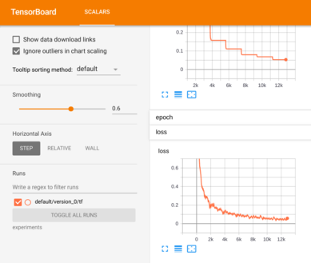

This is a quick implementation of row-by-row sequential MNIST, using [PyTorch Lightning](https://github.com/williamFalcon/pytorch-lightning).

#### Visualization

Run `tensorboard --logdir experiments` to visualize results in real time:

